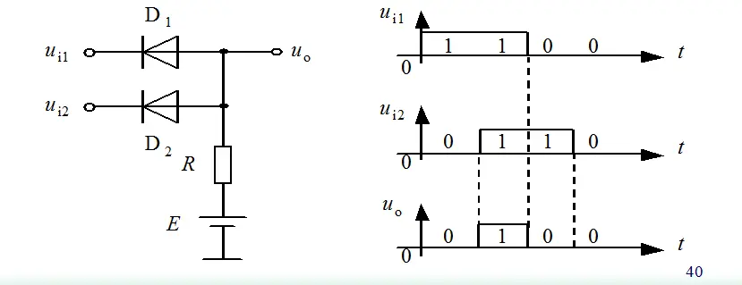

这就是一个非常简化的与门。

分析这个问题，需要把握一个原则。。。。

就是压差大的导通先拿掉二极管分析U0端处于高压状态。

根据以上原则，就是两个信号输入端哪个为低电平，哪个导通，另外一个不导通。

翻译过来，两个都是高电平，u0才会是高电平，否则期中一个导通就把电位拉成低电位了。

于是我们可以发现这其实是个与门。

> 编辑于 2019-06-03 08:01 ​赞同 140​
> 作者：飞柯
> 链接：https://www.zhihu.com/question/31228866/answer/51139084
> 来源：知乎
> 著作权归作者所有。商业转载请联系作者获得授权，非商业转载请注明出处。
