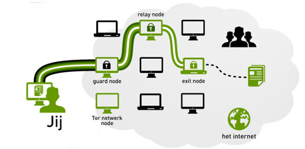

# Tor网络

Tor是一个三重代理（也就是说Tor每发出一个请求会先经过Tor网络的3个节点），其网络中有两种主要服务器角色：
- 中继服务器：负责中转数据包的路由器，可以理解为代理；
- 目录服务器：保存Tor网络中所有中继服务器列表相关信息（保存中继服务器地址、公钥）。

Tor客户端先与目录服务器通信获得全球活跃中继节点信息，然后再随机选择三个节点组成circuit （电路），用户流量跳跃这三个节点（hop）之后最终到达目标网站服务器。

用户流量会经过3重TLS加密，如下图所示：
